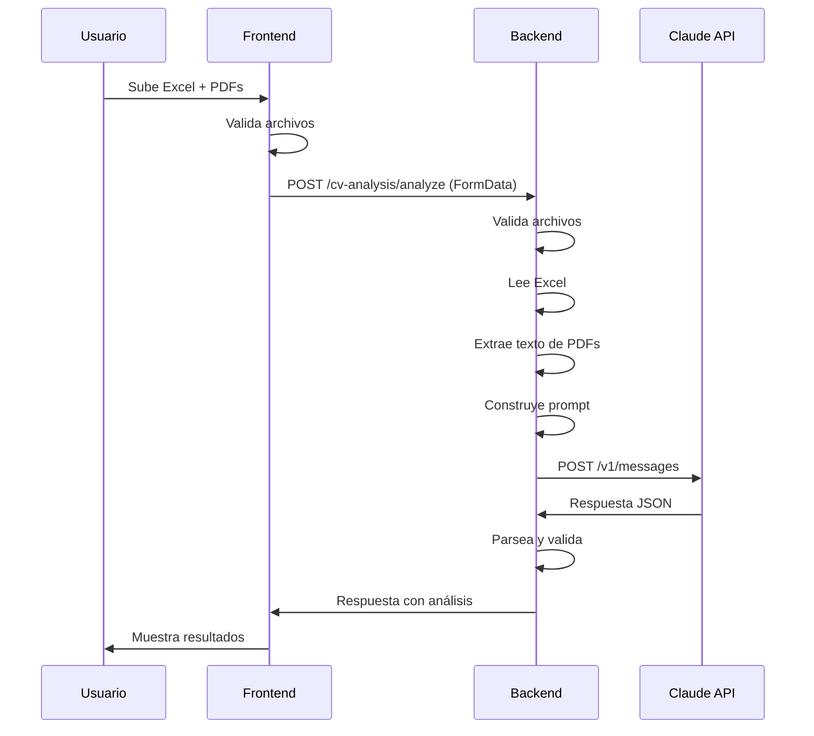

# Integración Frontend-Backend - Análisis de CVs

## ✅ Cambios Completados

El frontend ahora se conecta al backend para analizar CVs en lugar de llamar directamente a la API de Claude.

---

## 🔧 Cambios Realizados

### 1. Servicio Actualizado

**Archivo:** `src/app/core/services/cv-analysis.service.ts`

**Antes:**
- Llamaba directamente a `https://api.anthropic.com/v1/messages`
- Requería API key del usuario en el frontend
- Procesaba archivos en el navegador

**Ahora:**
- Llama a `${environment.apiUrl}/cv-analysis/analyze`
- API key vive en el backend (seguro)
- Envía archivos raw al backend vía FormData

**Método principal:**
```typescript
analyzeCV(excelFile: File, cvFiles: File[]): Observable<AnalysisResult> {
  const formData = new FormData();
  formData.append('excel', excelFile, excelFile.name);
  cvFiles.forEach((file) => {
    formData.append('cvs', file, file.name);
  });

  return this.http.post<any>(`${this.apiUrl}/analyze`, formData).pipe(
    map(response => {
      if (response.success && response.analysis) {
        return {
          resumen: response.analysis.resumen,
          candidatos: response.analysis.candidatos,
          rawResponse: JSON.stringify(response)
        } as AnalysisResult;
      }
      throw new Error('Respuesta inválida del servidor');
    }),
    catchError(this.handleError)
  );
}
```

---

### 2. Componente Simplificado

**Archivo:** `src/app/features/cv-analysis/cv-analysis.component.ts`

**Eliminado:**
- Campo de API key en el formulario
- Métodos `readFileAsText()` y `readPDFAsBase64()`
- Lógica de procesamiento de archivos
- Construcción del prompt

**Simplificado:**
```typescript
analyzeResumes() {
  if (!this.canAnalyze()) {
    this.error.set('Por favor selecciona un archivo Excel');
    return;
  }

  this.loading.set(true);
  this.error.set(null);

  // Llamar al servicio del backend directamente
  this.cvAnalysisService.analyzeCV(this.excelFile()!, this.pdfFiles()).subscribe({
    next: (result) => {
      this.analysisResult.set(result);
      this.loading.set(false);
    },
    error: (err) => {
      this.error.set(err.message || 'Error al analizar los CVs');
      this.loading.set(false);
    }
  });
}
```

---

### 3. Proxy Eliminado

**Eliminado:**
- `proxy.conf.json`
- Configuración de proxy en `angular.json`

**Razón:** Ya no es necesario porque ahora llamamos a nuestro propio backend que maneja CORS correctamente.

---

### 4. Environment Configuration

**Archivo:** `src/environments/environment.local.ts`

**Antes:**
```typescript
export const environment = {
  production: false,
  apiUrl: 'https://mv-whatsapp-backend.onrender.com/api',
  claudeApiKey: 'sk-ant-api03-...' // ❌ Expuesto en frontend
};
```

**Ahora:**
```typescript
export const environment = {
  production: false,
  apiUrl: 'https://mv-whatsapp-backend.onrender.com/api'
  // claudeApiKey ya no existe aquí - vive en el backend
};
```

---

## 📡 Endpoints del Backend

### 1. Analizar CVs

**Endpoint:** `POST /api/cv-analysis/analyze`

**Request:**
```http
POST /api/cv-analysis/analyze
Content-Type: multipart/form-data

excel: [archivo .xlsx o .csv]
cvs: [archivo1.pdf]
cvs: [archivo2.pdf]
...
```

**Response (Success):**
```json
{
  "success": true,
  "analysis": {
    "resumen": {
      "totalAnalizados": 5,
      "paraEntrevistar": 2,
      "quizas": 2,
      "descartados": 1,
      "top3": [
        {
          "nombre": "Juan Pérez",
          "score": 95,
          "razon": "Experiencia excepcional"
        }
      ]
    },
    "candidatos": [
      {
        "nombre": "Juan Pérez",
        "email": "juan@example.com",
        "telefono": "+1234567890",
        "score": 95,
        "categoria": "entrevistar",
        "fortalezaPrincipal": "5 años de experiencia",
        "banderaRoja": "Ninguna",
        "fortalezas": ["Proactividad", "Experiencia"],
        "areasAtencion": ["Mejorar inglés"],
        "consistencia": "CV y formulario alineados",
        "preguntaSugerida": "¿Cómo priorizas tareas?"
      }
    ]
  },
  "metadata": {
    "totalCandidatos": 5,
    "totalCVsProcesados": 4,
    "totalCVsConError": 1,
    "timestamp": "2024-12-15T10:30:00.000Z"
  }
}
```

**Response (Error):**
```json
{
  "success": false,
  "error": "Mensaje de error descriptivo"
}
```

---

### 2. Health Check

**Endpoint:** `GET /api/cv-analysis/health`

**Response:**
```json
{
  "status": "ok",
  "service": "cv-analysis",
  "claudeApiConfigured": true
}
```

---

## 🔒 Seguridad

### Antes (Inseguro)
```
Usuario → Frontend → API de Claude directamente
         ↓
    API Key expuesta en el navegador ❌
```

### Ahora (Seguro)
```
Usuario → Frontend → Backend → API de Claude
                       ↓
                  API Key en .env ✅
```

**Ventajas:**
1. ✅ API key nunca expuesta al cliente
2. ✅ Rate limiting controlado por el backend
3. ✅ Validaciones de archivos en el servidor
4. ✅ Logs centralizados en el backend
5. ✅ CORS manejado correctamente

---

## 🚀 Cómo Usar

### 1. Configurar Backend

En el servidor, asegúrate de tener la variable de entorno:

```bash
CLAUDE_API_KEY=sk-ant-api03-xxxxx
```

### 2. Configurar Frontend

En `src/environments/environment.ts`:

```typescript
export const environment = {
  production: false,
  apiUrl: 'http://localhost:3000/api' // Para desarrollo local
};
```

En `src/environments/environment.prod.ts`:

```typescript
export const environment = {
  production: true,
  apiUrl: 'https://mv-whatsapp-backend.onrender.com/api' // Para producción
};
```

### 3. Iniciar Aplicación

**Backend:**
```bash
npm run dev
```

**Frontend:**
```bash
npm start
```

### 4. Usar la Aplicación

1. Ve a [http://localhost:4200/cv-analysis](http://localhost:4200/cv-analysis)
2. Sube el archivo Excel (obligatorio)
3. Sube CVs en PDF (opcional)
4. Click en "🚀 Analizar Candidatos"
5. Espera 1-2 minutos
6. Revisa los resultados

---

## 🐛 Manejo de Errores

El frontend maneja estos errores del backend:

| Código | Significado | Mensaje al Usuario |
|--------|-------------|-------------------|
| 400 | Archivos inválidos | "Archivos inválidos. Verifica el formato." |
| 429 | Rate limit excedido | "Has excedido el límite de análisis. Intenta más tarde." |
| 500 | Error del servidor | "Error en el servidor al procesar los archivos." |
| 503 | Servicio no disponible | "El servicio no está disponible. Contacta al administrador." |

**Ejemplo de código:**

```typescript
private handleError(error: HttpErrorResponse) {
  let errorMessage = 'Ocurrió un error desconocido';

  switch (error.status) {
    case 400:
      errorMessage = error.error?.error || 'Archivos inválidos';
      break;
    case 429:
      errorMessage = 'Has excedido el límite de análisis';
      break;
    // ... más casos
  }

  return throwError(() => new Error(errorMessage));
}
```

---

## 📊 Flujo Completo



---

## 🔍 Debugging

### Frontend

Ver logs en consola del navegador:

```typescript
console.log('📤 Enviando análisis al backend...');
console.log(`📊 Excel: ${excelFile.name}`);
console.log(`📄 CVs: ${cvFiles.length} archivos`);
```

### Backend

Ver logs del servidor:

```javascript
console.log('📥 Recibiendo solicitud de análisis');
console.log('📊 Archivo Excel:', req.files.excel[0].originalname);
console.log('📄 CVs:', req.files.cvs?.length || 0);
```

### Network

Inspecciona la petición en DevTools → Network:

```
Request URL: http://localhost:3000/api/cv-analysis/analyze
Request Method: POST
Content-Type: multipart/form-data
```

---

## 📝 Checklist de Implementación

Backend:
- [ ] Endpoint POST `/api/cv-analysis/analyze` implementado
- [ ] Multer configurado para archivos
- [ ] Claude SDK instalado y configurado
- [ ] Variable de entorno `CLAUDE_API_KEY` configurada
- [ ] CORS habilitado para el frontend
- [ ] Rate limiting implementado
- [ ] Validaciones de archivos

Frontend:
- [x] Servicio actualizado para llamar al backend
- [x] Componente simplificado (sin API key)
- [x] Proxy eliminado
- [x] Environment configurado
- [x] Manejo de errores
- [x] Build exitoso

---

## 🎯 Próximos Pasos

1. **Implementar el backend** usando el prompt que te di
2. **Configurar la API key** en el servidor
3. **Probar la integración** end-to-end
4. **Desplegar a producción**

---

## 💡 Tips

1. **Desarrollo local:** Usa `http://localhost:3000/api` en environment.ts
2. **CORS:** Asegúrate de que el backend permita requests del frontend
3. **Límites:** El backend puede validar tamaño de archivos antes de Claude
4. **Logs:** Ambos lados deben loggear para debug
5. **Errores:** Propaga errores descriptivos del backend al frontend

---

¿Listo para implementar el backend? Usa el prompt que te compartí antes! 🚀
